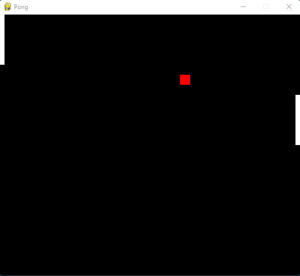

# Pong

This is an implementation of reinforcement learning which is able to play the game pong.
Take a look at the source code and if you want to play a bit visit
my [Unity version of pong](https://github.com/le-tim/le_pong_unity.git) which is playable
under [lelar.ge](https://pong.lelar.ge).

